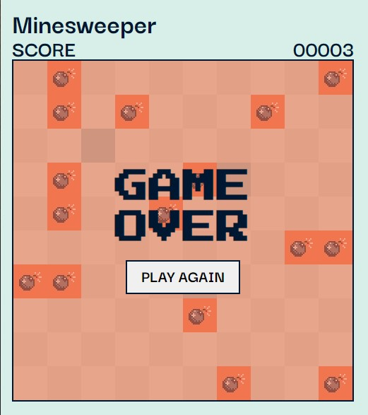

<!-- PROJECT -->

<a id="readme-top"></a>

<div align="center">
  

  <h3 align="center">Minesweeper</h3>

  <p align="center">
    A simple game to practise JavaScript!
  </p>
</div>

<!-- TABLE OF CONTENTS -->
<details>
  <summary>Table of Contents</summary>
  <ol>
    <li>
      <a href="#about-the-project">About The Project</a>
      <ul>
        <li>
            <a href="#built-with">Built With</a>
        </li>
        <li>
            <a href="#gameplay">Gameplay</a>
        </li>
        <li>
            <a href="#key-features">Key Features</a>
        </li>
      </ul>
    </li>
    <li>
        <a href="#getting-started">Getting Started</a>
    </li>
    <li>
        <a href="#contacts">Contacts</a>
    </li>
    <li>
        <a href="#references">References</a>
    </li>
    <li>
        <a href="#license">License</a>
    </li>
  </ol>
</details>

<!-- ABOUT THE PROJECT -->

## About The Project

This project is a simple grid-based game where the player clicks on cells to reveal their contents. The game features a 10x10 grid with 16 randomly placed bombs. The player's goal is to click on as many non-bomb cells as possible without detonating a bomb.

### Built With

<div display="flex">
  
    
	
 	
</div>

### Gameplay

1. The game starts with a 10x10 grid of cells, each with a gray or white background.
2. The player clicks on a cell to reveal its contents.
3. If the cell is a bomb, the game ends and the player loses.
4. If the cell is not a bomb, the player earns points and the cell is marked as clicked.
5. The game continues until the player detonates a bomb or clicks on all non-bomb cells.

### Key Features

- Randomly generated bomb locations
- Dynamic grid generation based on game settings
- Real-time scoring and game over detection
- Visual feedback for clicked cells and bombs

### Settings

- **totalCells**: The total number of cells in the grid (`default: 100`).
- **totalBombs**: The total number of bombs in the grid (`default: 16`).
- **maxScore**: The maximum score the player can achieve (`default: totalCells - totalBombs`).

<p align="right">(<a href="#readme-top">back to top</a>)</p>

<!-- GETTING STARTED -->

## Getting Started

To get a local copy up and running follow these simple example steps.

1. Clone the repository to your local machine
   ```sh
   git clone https://github.com/majinbrum/minesweeper.git
   ```
2. Change git remote url to avoid accidental pushes to base project
   ```sh
   git remote set-url origin github_username/repo_name
   git remote -v # confirm the changes
   ```
3. Open your web browser and navigate to http://localhost:3000.

<p align="right">(<a href="#readme-top">back to top</a>)</p>

<!-- CONTACTS -->

## Contacts

**Bruna Alamia** **-** [@linkedin](https://linkedin.com/in/brunaalamia) **-** brunaalamia@gmail.com

<p align="right">(<a href="#readme-top">back to top</a>)</p>

<!-- LICENSE -->

## License

This project is licensed under the MIT License.

<p>Copyright (c) 2024 Bruna Alamia

Permission is hereby granted, free of charge, to any person
obtaining a copy of this software and associated documentation
files (the "Software"), to deal in the Software without
restriction, including without limitation the rights to use,
copy, modify, merge, publish, distribute, sublicense, and/or sell
copies of the Software, and to permit persons to whom the
Software is furnished to do so, subject to the following
conditions:

The above copyright notice and this permission notice shall be
included in all copies or substantial portions of the Software.

THE SOFTWARE IS PROVIDED "AS IS", WITHOUT WARRANTY OF ANY KIND,
EXPRESS OR IMPLIED, INCLUDING BUT NOT LIMITED TO THE WARRANTIES
OF MERCHANTABILITY, FITNESS FOR A PARTICULAR PURPOSE AND
NONINFRINGEMENT. IN NO EVENT SHALL THE AUTHORS OR COPYRIGHT
HOLDERS BE LIABLE FOR ANY CLAIM, DAMAGES OR OTHER LIABILITY,
WHETHER IN AN ACTION OF CONTRACT, TORT OR OTHERWISE, ARISING
FROM, OUT OF OR IN CONNECTION WITH THE SOFTWARE OR THE USE OR
OTHER DEALINGS IN THE SOFTWARE.</p>
